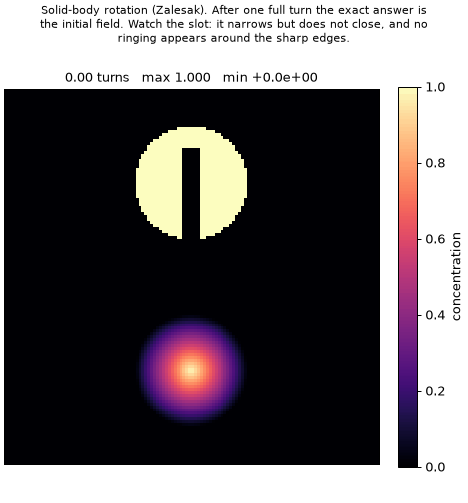
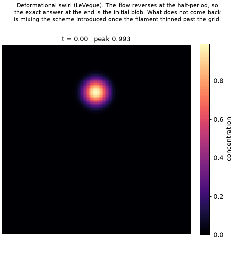

# A0 figures — the 1-D PPM kernels

Everything here is regenerated by two scripts, both of which run in seconds:

```bash
python scripts/make_a0_figures.py       # numerical validation
python scripts/make_a0_flow_figures.py  # 2-D benchmarks and animations
```

The figures split into two groups. The first four answer *is the port correct?*
The rest answer *what does the scheme actually do to a field?*

---

## Animations

### `rotation.gif` — Zalesak solid-body rotation



A smooth cone and a slotted cylinder are carried once around the domain by a
rigid rotation. **The exact answer after a full turn is the initial field**, so
every difference you can see is scheme error rather than physics.

77 frames, one full revolution, 128×128 cells, Courant 0.40, 1000 time steps.
The title updates each frame with elapsed turns and the running min and max.

**What to watch for**

| | |
|---|---|
| **The slot** | It narrows as diffusion works on it but never closes. A scheme with too much numerical diffusion fills it in within half a turn. |
| **The sharp edges** | The cylinder's vertical sides stay vertical. An unlimited high-order scheme would ring here — visible as bright haloes outside the disc and dark rims inside it. |
| **The `min` readout** | It stays at zero to within 1e-32. Any negative value would mean the limiter had failed, and negative concentrations are how an air-quality model produces nonsense downstream. |
| **The cone** | It loses height steadily. This is the honest cost of the scheme, and the smooth shape is where you can see it clearly. |

The slotted cylinder is the point of this benchmark. Every one of its features —
vertical walls, a flat top, a narrow slot — is a discontinuity, and
discontinuities are exactly where high-order schemes misbehave.

### `deformation.gif` — LeVeque deformational swirl



A single vortex winds a smooth blob into a filament thinner than the grid can
represent. Because the velocity field carries a `cos(πt/T)` factor, the flow
**reverses at the half-period** and unwinds it. As with the rotation, the exact
answer at the end is the initial blob.

74 frames, period 3.0, 128×128 cells, Courant 0.40. The title reports elapsed
time, which phase the flow is in, and the running peak.

**What to watch for**

| | |
|---|---|
| **The peak, during winding** | It falls as the filament thins. Once a feature is narrower than a cell, no scheme can represent it, and the information is gone. |
| **The peak, after reversal** | It does **not** climb back. The flow is reversible; the discretisation is not. That gap is the scheme's irreversible mixing. |
| **The returned blob** | Slightly broader and lower than it started, and no longer quite circular. |

This is the harder of the two tests. Rotation only translates a shape;
deformation actively destroys structure and then asks for it back.

---

## Static panels

| File | What it shows |
|---|---|
| `rotation_2d.png` | The rotation at each quarter turn plus an error map. **Phase error 0.003 cells** — the shapes return where they started, so the error is edge diffusion, not displacement. Slot 23% filled, cone peak 0.963 → 0.883, cylinder plateau holds at 1.000, mass conserved to 7e-13. |
| `rotation_3d.png` | The rotation as a surface, before and after. Ringing is unmistakable in this view in a way a contour plot hides — and there is none. |
| `deformation_2d.png` | The swirl at four stages, the error after return (max 24% of peak), and a trace of peak amplitude and Σc² against time. Both fall and neither recovers; mass holds to machine precision. |
| `fortran_agreement.png` | Per-case disagreement with `hppm.F` against the float32 epsilon line. Worst case ~1.7 float32 ULPs; three of ten cases bit-identical. |
| `convergence.png` | Error against grid refinement for a Gaussian, annotated with the measured order at each step. |
| `limiter_action.png` | The reconstructed parabola in every cell for a smooth profile, the same profile with a step, and with a spike. |
| `transport.png` | A Gaussian and a square wave after one full revolution in 1-D. |
| `vertical_stretching.png` | The non-uniform reconstruction on 35 CMAQ-like sigma layers, 6× thicker aloft than at the surface. |

---

## Reading the error map in `rotation_2d.png`

The map reports a maximum absolute error of about **0.73**, which looks alarming
next to a field whose peak is 1.0. It is not, and the reason is worth stating
because an L-infinity norm conflates two very different failures.

- **A shape returning to the wrong place** is a phase error, and it is serious:
  it means the scheme transports at the wrong speed, and the error compounds
  every step.
- **A shape returning to the right place with smeared edges** is diffusion at a
  discontinuity, which every monotone scheme has and which does not compound in
  the same way.

Measuring the cylinder's centroid separates them: it moves **0.003 cells over a
whole revolution**. The 0.73 sits on a cell that started at exactly 1.0 and
ended around 0.27, on the slot wall. That is the second kind of error, and the
figure's caption leads with the phase number for exactly this reason.

---

## An important caveat

**The 2-D figures do not use CMAQ's HADV driver.** They apply the validated A0
1-D kernel alternately along each axis with periodic wrapping. That leaves out:

- boundary conditions (`BCON` inflow, zero-flux-divergence outflow)
- the contravariant velocity, `UHAT_JD / mean(DENSA_J)`
- per-layer advection sub-stepping driven by `ASTEP`
- CMAQ's per-layer `XYFIRST` parity, rather than the fixed alternation used here

Those arrive in **A1**, and these same two benchmarks re-run through the real
driver become the A1 gate. The numerics being exercised — reconstruction,
limiter, flux, conservative update — are exactly the ones validated against
`hppm.F` in `tests/regression/`.
