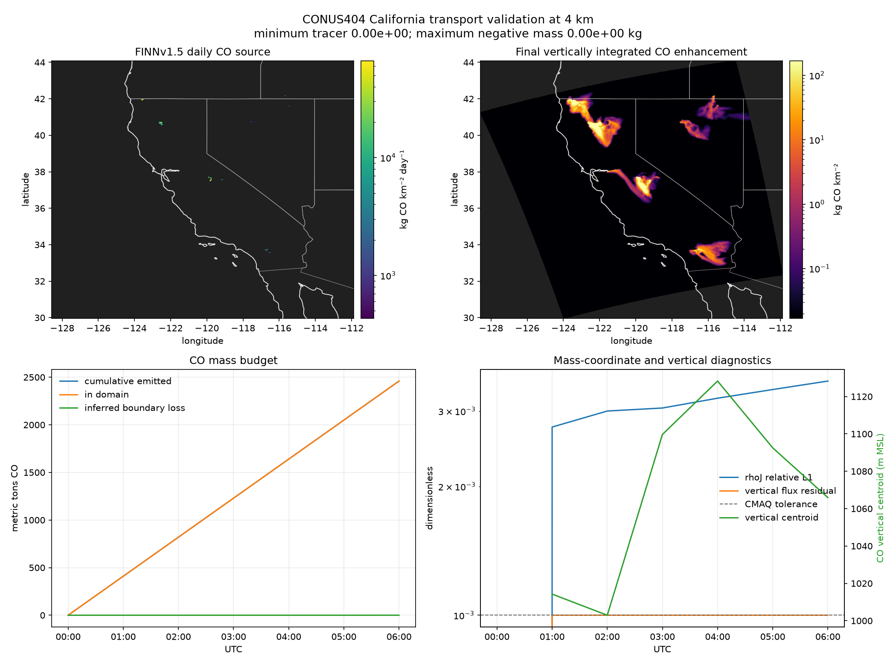

# California CONUS404 transport validation

This experiment drives the CMAQ/JAX horizontal and vertical PPM advection
operators with real hourly CONUS404 meteorology and daily FINN fire CO.  It is a
transport validation, not an air-quality forecast: CO is an inert enhancement
tracer, and clean inflow means the run has no background CO.

The existing `examples/california/` NARR animation remains a quick visual smoke
test.  It has only five pressure levels, omits vertical advection, and resets
atmospheric mass.  This experiment instead uses all 50 WRF layers and never
resets density.

## Reproduce the July 26, 2018 case

Install the I/O and figure dependencies into the repository environment:

```bash
uv pip install -e ".[dev,io]"
```

Download seven hourly meteorology records for a six-hour native-grid California
run, plus that day's public FINNv1.5 each-fire inventory:

```bash
.venv/bin/python examples/conus404/download_conus404.py \
    --start 2018-07-26T00:00:00 --hours 6
.venv/bin/python examples/conus404/download_finn.py --date 2018-07-26
```

Run at native 4 km and conservative 8 km coarsening:

```bash
.venv/bin/python examples/conus404/run_transport.py \
    --met examples/conus404/data/conus404_20180726_00_06h.nc \
    --finn examples/conus404/data/GLOB_MOZ4_2018207.txt.gz \
    --coarsen 1

.venv/bin/python examples/conus404/run_transport.py \
    --met examples/conus404/data/conus404_20180726_00_06h.nc \
    --finn examples/conus404/data/GLOB_MOZ4_2018207.txt.gz \
    --coarsen 2
```

`--coarsen 4`, `6`, or `9` gives a 16, 24, or 36 km development run without
downloading different forcing.  Cell-centred intensive fields are block
averaged, FINN mass is block summed, and coarse-grid winds retain coincident WRF
faces before averaging along the face.

Compare resolutions and regenerate the figures:

```bash
.venv/bin/python examples/conus404/compare_resolution.py \
    --fine examples/conus404/output/transport_20180726_00_4km.npz \
    --coarse examples/conus404/output/transport_20180726_00_8km.npz

.venv/bin/python examples/conus404/fetch_boundaries.py
.venv/bin/python examples/conus404/make_visualizations.py \
    --run examples/conus404/output/transport_20180726_00_4km.npz \
    --diagnostics examples/conus404/output/transport_20180726_00_4km.csv
```

The 8 km GIF is generated by changing both `4km` occurrences in the last
command to `8km`.  Downloaded data and numeric outputs are git-ignored; the
small, regenerable GIF and PNG results under `figures/` are committed.

## Physical construction

- **Meteorology:** [CONUS404](https://www.usgs.gov/data/conus404-four-kilometer-long-term-regional-hydroclimate-reanalysis-over-conterminous-united),
  a 4 km WRF reanalysis forced by ERA5.  The downloader takes native OPeNDAP
  hyperslabs from NCAR RDA dataset `ds559.0`; it does not regrid the 4 km case.
- **Grid:** WRF's native C-staggered `U` and `V`, all 50 terrain-following
  layers, and all 51 `ZNW` faces.  The default rectangular computational window
  is 295 × 328 × 50 cells and contains the requested
  124.75–114°W, 32–42.25°N box.
- **Atmospheric mass:** the processed CONUS404 `MU` field already stores
  `MU+MUB`.  Because this WRF run has `HYBRID_OPT=-1`, the equations in EPA
  MCIP's [`metvars2ctm.f90`](https://github.com/USEPA/CMAQ/blob/main/PREP/mcip/src/metvars2ctm.f90)
  reduce exactly to

  ```text
  DENSA_J = (MU + MUB) / (g * MAPFAC_M**2)
  ```

  This `rhoJ` field occupies the last transported species slot on every layer.
- **Vertical transport:** CMAQ's WRF-consistent ZADV diagnoses its face mass
  flux from the difference between horizontally transported `rhoJ` and the
  meteorological field.  Raw WRF `W` is therefore not substituted into a
  different vertical-coordinate equation.
- **Emissions:** daily 1 km FINNv1.5 each-fire CO, mapped to the nearest native
  cell without losing mass.  FINN gas emissions are moles/day, converted with
  a CO molar mass of 28.01 g/mol and injected into the lowest layer.  The
  [current FINN release and unit conventions](https://www2.acom.ucar.edu/facility/finn)
  are documented by NCAR; this reproducible unauthenticated archive is clearly
  kept as v1.5 rather than relabelled v2.5.
- **Boundaries:** zero CO enhancement at inflow; real CONUS404 `rhoJ` at each
  boundary cell and layer.  CMAQ's zero-flux-divergence rule handles outflow.
- **Time stepping:** CMAQ's Courant and positive-divergence constraints choose
  the sync and per-layer advection steps.  Winds and `rhoJ` are linearly
  interpolated in time.  A split half-source is applied before and after every
  sync step.

## Measured result

Both runs cover 00–06 UTC on July 26, 2018 and use 66 FINN fire points totalling
9,839.1 metric tons CO/day.

| Diagnostic at hour 6 | 4 km | 8 km |
|---|---:|---:|
| horizontal cells × layers | 295 × 328 × 50 | 147 × 164 × 50 |
| sync steps / wall time on the development laptop | 204 / 295 s | 93 / 36 s |
| emitted CO | 2,459,771 kg | 2,459,771 kg |
| CO remaining in domain | 2,459,591 kg | 2,459,655 kg |
| inferred boundary loss | 180 kg | 116 kg |
| minimum tracer / negative mass | 0 / 0 kg | 0 / 0 kg |
| `rhoJ` relative L1 mismatch | 0.352% | 0.625% |
| CO vertical centroid, MSL | 1,066 m | 1,056 m |
| maximum vertical flux residual | 1.000 × 10⁻³ | 1.000 × 10⁻³ |

After aggregating the 4 km result onto the common 8 km cells, the 8 km run has
a total-mass ratio of 1.000031, a normalized spatial L1 difference of 0.292,
and a centre-of-mass displacement of 2.09 km.  Total mass is converged much more
closely than plume shape; the 29% spatial difference is evidence that 4 km is
the more useful result for this short fire-plume test.

`inferred_boundary_loss_kg` is the domain mass change after accounting for the
known source.  It includes roundoff and is not an independently integrated
face-flux diagnostic; `budget_residual_kg` is consequently an arithmetic
closure check, not a second conservation measurement.

## Figures



- [`transport_20180726_00_4km.gif`](figures/transport_20180726_00_4km.gif) —
  native-grid CO column enhancement with surface winds and live domain mass.
- [`transport_20180726_00_8km.gif`](figures/transport_20180726_00_8km.gif) — the
  conservative 8 km companion.
- The summary PNGs show the source, final column plume, mass budget, `rhoJ`
  closure, vertical-flux residual, and vertical centroid.

## Limits on interpretation

The tracer is emitted at the surface with no fire plume rise.  The experiment
does not run chemistry, dry or wet deposition, aerosol thermodynamics,
gravitational settling, horizontal diffusion, or ACM2 turbulent vertical
mixing.  It validates the HADV→ZADV advection pair against real, mass-consistent
meteorology.  It does **not** validate PM2.5 concentrations or reproduce
observed smoke.  A forecast comparison would need a current FINN inventory,
plume-rise treatment, the omitted physics, background chemical boundary
conditions, and observations.
