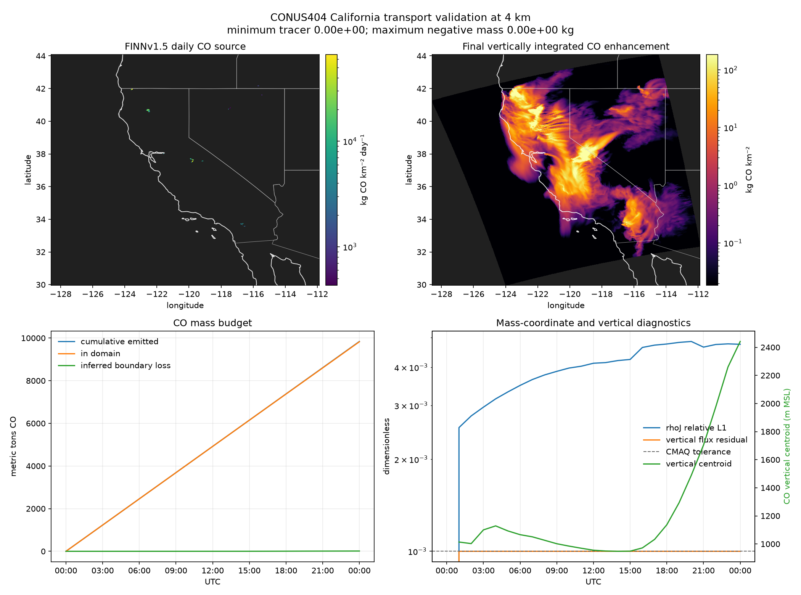

# California CONUS404 transport validation

This experiment drives the CMAQ/JAX horizontal and vertical PPM advection
operators with real hourly CONUS404 meteorology and daily FINN fire CO.  It is a
transport validation, not an air-quality forecast: CO is an inert enhancement
tracer, and clean inflow means the run has no background CO.

The existing [`examples/california/`](../california/README.md) NARR animation
remains a quick visual smoke test.  It has only five pressure levels, omits vertical advection, and resets
atmospheric mass.  This experiment instead uses all 50 WRF layers and never
resets density.

## Reproduce the July 26, 2018 case

Install the I/O and figure dependencies into the repository environment:

```bash
uv pip install -e ".[dev,io]"
```

Download seven hourly meteorology records for a six-hour native-grid California
run, plus that day's public FINNv1.5 each-fire inventory:

```bash
.venv/bin/python examples/conus404/download_conus404.py \
    --start 2018-07-26T00:00:00 --hours 6
.venv/bin/python examples/conus404/download_finn.py --date 2018-07-26
```

The six-hour subset can be reused as a template when extending the forcing to
24 hours.  Matching records and all static grid fields are copied locally, so
only the 18 missing hourly records are fetched:

```bash
.venv/bin/python examples/conus404/download_conus404.py \
    --start 2018-07-26T00:00:00 --hours 24 \
    --template examples/conus404/data/conus404_20180726_00_06h.nc
```

Run at native 4 km and conservative 8 km coarsening:

```bash
.venv/bin/python examples/conus404/run_transport.py \
    --met examples/conus404/data/conus404_20180726_00_06h.nc \
    --finn examples/conus404/data/GLOB_MOZ4_2018207.txt.gz \
    --coarsen 1

.venv/bin/python examples/conus404/run_transport.py \
    --met examples/conus404/data/conus404_20180726_00_06h.nc \
    --finn examples/conus404/data/GLOB_MOZ4_2018207.txt.gz \
    --coarsen 2
```

For the smoother 24-hour animation, request exact model states every 15
minutes.  These are transport synchronization points, not visual interpolation:

```bash
.venv/bin/python examples/conus404/run_transport.py \
    --met examples/conus404/data/conus404_20180726_00_24h.nc \
    --finn examples/conus404/data/GLOB_MOZ4_2018207.txt.gz \
    --coarsen 1 --frame-minutes 15 \
    --output examples/conus404/output/transport_20180726_00_24h_4km
```

`--coarsen 4`, `6`, or `9` gives a 16, 24, or 36 km development run without
downloading different forcing.  Cell-centred intensive fields are block
averaged, FINN mass is block summed, and coarse-grid winds retain coincident WRF
faces before averaging along the face.

Compare resolutions and regenerate the figures:

```bash
.venv/bin/python examples/conus404/compare_resolution.py \
    --fine examples/conus404/output/transport_20180726_00_4km.npz \
    --coarse examples/conus404/output/transport_20180726_00_8km.npz

.venv/bin/python examples/conus404/fetch_boundaries.py
.venv/bin/python examples/conus404/make_visualizations.py \
    --run examples/conus404/output/transport_20180726_00_4km.npz \
    --diagnostics examples/conus404/output/transport_20180726_00_4km.csv

.venv/bin/python examples/conus404/make_visualizations.py \
    --run examples/conus404/output/transport_20180726_00_24h_4km.npz \
    --diagnostics examples/conus404/output/transport_20180726_00_24h_4km.csv \
    --interpolation 1 --fps 12
```

The 8 km GIF is generated by changing both `4km` occurrences in the last
command to `8km`.  Downloaded data and numeric outputs are git-ignored; the
small, regenerable GIF and PNG results under `figures/` are committed.

## Physical construction

- **Meteorology:** [CONUS404](https://www.usgs.gov/data/conus404-four-kilometer-long-term-regional-hydroclimate-reanalysis-over-conterminous-united),
  a 4 km WRF reanalysis forced by ERA5.  The downloader takes native OPeNDAP
  hyperslabs from NCAR RDA dataset `ds559.0`; it does not regrid the 4 km case.
- **Grid:** WRF's native C-staggered `U` and `V`, all 50 terrain-following
  layers, and all 51 `ZNW` faces.  The default rectangular computational window
  is 295 × 328 × 50 cells and contains the requested
  124.75–114°W, 32–42.25°N box.
- **Atmospheric mass:** the processed CONUS404 `MU` field already stores
  `MU+MUB`.  Because this WRF run has `HYBRID_OPT=-1`, the equations in EPA
  MCIP's [`metvars2ctm.f90`](https://github.com/USEPA/CMAQ/blob/main/PREP/mcip/src/metvars2ctm.f90)
  reduce exactly to

  ```text
  DENSA_J = (MU + MUB) / (g * MAPFAC_M**2)
  ```

  This `rhoJ` field occupies the last transported species slot on every layer.
- **Vertical transport:** CMAQ's WRF-consistent ZADV diagnoses its face mass
  flux from the difference between horizontally transported `rhoJ` and the
  meteorological field.  Raw WRF `W` is therefore not substituted into a
  different vertical-coordinate equation.
- **Emissions:** daily 1 km FINNv1.5 each-fire CO, mapped to the nearest native
  cell without losing mass.  FINN gas emissions are moles/day, converted with
  a CO molar mass of 28.01 g/mol and injected into the lowest layer.  The
  [current FINN release and unit conventions](https://www2.acom.ucar.edu/facility/finn)
  are documented by NCAR; this reproducible unauthenticated archive is clearly
  kept as v1.5 rather than relabelled v2.5.
- **Lowest-layer concentration:** every animation frame also stores the first
  WRF layer's dry-air CO mole-fraction enhancement.  The coupled CO mass is
  divided by transported `rhoJ` to recover kg CO per kg dry air, then converted
  to ppbv with 28.9647 and 28.01 g mol⁻¹ for dry air and CO, respectively.  This
  conversion does not require an assumed layer volume, pressure, or temperature.
- **Boundaries:** zero CO enhancement at inflow; real CONUS404 `rhoJ` at each
  boundary cell and layer.  CMAQ's zero-flux-divergence rule handles outflow.
- **Time stepping:** CMAQ's Courant and positive-divergence constraints choose
  the sync and per-layer advection steps.  Winds and `rhoJ` are linearly
  interpolated in time.  A split half-source is applied before and after every
  sync step.

## Measured result

Both runs cover 00–06 UTC on July 26, 2018 and use 66 FINN fire points totalling
9,839.1 metric tons CO/day.

| Diagnostic at hour 6 | 4 km | 8 km |
|---|---:|---:|
| horizontal cells × layers | 295 × 328 × 50 | 147 × 164 × 50 |
| sync steps / wall time on the development laptop | 204 / 295 s | 93 / 36 s |
| emitted CO | 2,459,771 kg | 2,459,771 kg |
| CO remaining in domain | 2,459,591 kg | 2,459,655 kg |
| inferred boundary loss | 180 kg | 116 kg |
| minimum tracer / negative mass | 0 / 0 kg | 0 / 0 kg |
| `rhoJ` relative L1 mismatch | 0.352% | 0.625% |
| CO vertical centroid, MSL | 1,066 m | 1,056 m |
| maximum vertical flux residual | 1.000 × 10⁻³ | 1.000 × 10⁻³ |

After aggregating the 4 km result onto the common 8 km cells, the 8 km run has
a total-mass ratio of 1.000031, a normalized spatial L1 difference of 0.292,
and a centre-of-mass displacement of 2.09 km.  Total mass is converged much more
closely than plume shape; the 29% spatial difference is evidence that 4 km is
the more useful result for this short fire-plume test.

The native 4 km 24-hour run used 804 synchronization steps and finished in
1,159.8 s (19 min 20 s) on the development laptop's CPU.  It wrote 97 exact
model frames at 15-minute intervals.  At 00 UTC July 27 it had emitted
9,839,085.84 kg CO, retained 9,826,544.18 kg, and inferred 12,541.66 kg of
boundary loss.  The budget residual and negative tracer mass were both zero;
the final `rhoJ` relative L1 mismatch was 0.476%, and the final CO vertical
centroid was 2,442 m MSL.

`inferred_boundary_loss_kg` is the domain mass change after accounting for the
known source.  It includes roundoff and is not an independently integrated
face-flux diagnostic; `budget_residual_kg` is consequently an arithmetic
closure check, not a second conservation measurement.

## JAX Metal test

An isolated Apple-GPU test was run on the same development laptop (Apple M4
Pro, 48 GB unified memory, macOS 26.2) with `jax-metal==0.1.1` and
`jax==jaxlib==0.5.0`.  The main CPU environment, which uses JAX/JAXLIB 0.11.1,
was not changed.  Apple labels the
[Metal plug-in experimental](https://developer.apple.com/metal/jax/) and does
not support float64, so every transport field remained float32.

The runner does not currently work on Metal unchanged: the one-time
`nonuniform_mesh` construction aborts inside MPSGraph with an unresolved
`ndArrayOffsetIdentity32` function.  For benchmarking only, its static
coefficients were precomputed on CPU and transferred to Metal.  With that
temporary workaround, HADV→ZADV completed at all three resolutions:

| Six-hour grid | CPU | Metal | Metal versus CPU |
|---|---:|---:|---:|
| 36 km | 6.0 s | 8.8 s | 47% slower |
| 8 km | 36.0 s | 36.0 s | no change |
| 4 km | 295.0 s | 336.1 s | 14% slower |

The final column fields remained close: normalized CPU/Metal L1 differences
were `6.4e-8`, `1.28e-7`, and `1.29e-7` at 36, 8, and 4 km.  However, at 8 and
4 km Metal reported a maximum vertical flux-adjustment residual of `1.0`, while
CPU met CMAQ's `1e-3` tolerance.  This makes Metal unsuitable as a validated
backend for this experiment even though the resulting plume is nearly the
same.  It also gives no speed benefit for a two-slot state (`CO`, `rhoJ`).  A
larger chemical mechanism, an ensemble, or batched sensitivities could offer
more GPU parallelism, but that benefit has not been demonstrated here.

These timings are not a perfectly controlled backend comparison because the
Metal plug-in required an older JAX/JAXLIB version.  They answer the practical
question for the available software stack: use CPU for this California test.

## Figures



- [`transport_20180726_00_24h_4km.gif`](figures/transport_20180726_00_24h_4km.gif)
  — 97 native-grid model frames at 15-minute intervals, with surface winds and
  live domain mass.
- [`transport_20180726_00_24h_4km_ground_level.gif`](figures/transport_20180726_00_24h_4km_ground_level.gif)
  — the same 97 times and winds, showing CO enhancement in the lowest WRF layer
  in ppbv on a fixed logarithmic scale.
- [`transport_20180726_00_4km.gif`](figures/transport_20180726_00_4km.gif) — the
  original six-hour native-grid result with hourly model frames.
- [`transport_20180726_00_8km.gif`](figures/transport_20180726_00_8km.gif) — the
  conservative 8 km companion.
- The summary PNGs show the source, final column plume, mass budget, `rhoJ`
  closure, vertical-flux residual, and vertical centroid.

## Limits on interpretation

The tracer is emitted at the surface with no fire plume rise.  The experiment
does not run chemistry, dry or wet deposition, aerosol thermodynamics,
gravitational settling, horizontal diffusion, or ACM2 turbulent vertical
mixing.  It validates the HADV→ZADV advection pair against real, mass-consistent
meteorology.  It does **not** validate PM2.5 concentrations or reproduce
observed smoke.  A forecast comparison would need a current FINN inventory,
plume-rise treatment, the omitted physics, background chemical boundary
conditions, and observations.

In particular, the lowest-layer GIF is not a monitor-equivalent surface CO
prediction.  With emissions injected into that layer but no plume rise or
planetary-boundary-layer mixing, its 26,445 ppbv maximum occurs in source cells
and is unrealistically concentrated.  The animation is useful for diagnosing
near-surface advection; absolute ground-level concentrations require vertical
turbulent mixing first.

FINNv1.5 is a daily inventory.  The July 26 source is applied at a constant rate
from 00 UTC July 26 through 00 UTC July 27; the 15-minute animation therefore
resolves transport and changing winds, not sub-daily fire-emission variability.
