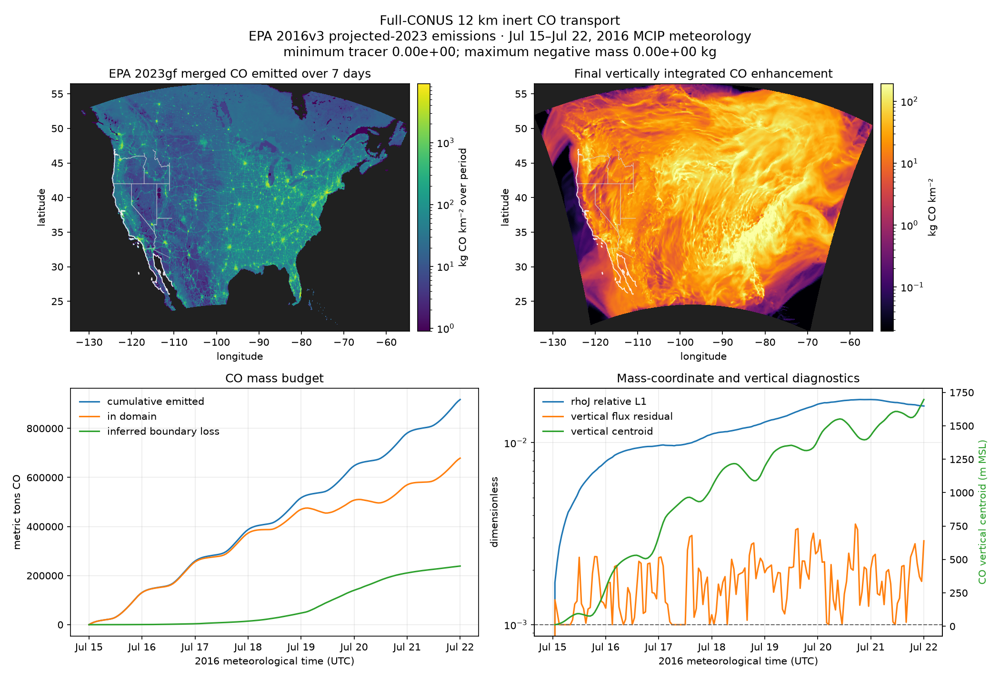
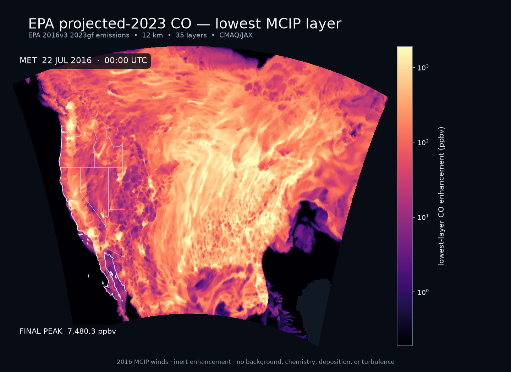

# Full-CONUS 12 km projected-2023 CO transport

This experiment transports an inert CO enhancement on EPA's 459 × 299 cell
`12US1` modeling domain.  It uses all 35 MCIP layers, the native C-staggered
winds, CMAQ/JAX horizontal and vertical advection, and supports continuous
state carryover across consecutive daily input files.  Both a 24-hour case and
a seven-day case have been completed.

The completed case is:

> EPA 2016v3 `2023gf` projected emissions · July 15–22, 2016 matching MCIP
> meteorology

That date pairing is intentional.  EPA's
[2016v3 platform](https://www.epa.gov/air-emissions-modeling/2016v3-platform)
provides analytic 2023 emissions with the 2016 meteorology and temporal
profiles used to build the case.  This is therefore a 2023 **emissions
scenario**, not transport under July 2023 weather.

The [USGS CONUS404 release](https://www.usgs.gov/data/conus404-four-kilometer-long-term-regional-hydroclimate-reanalysis-over-conterminous-united)
now extends through 2024, but its readily accessible hourly subset does not
provide the all-level 3-D winds needed here for 2023.  The full raw WRF archive
requires a separate archive request.  Using EPA's internally matched MCIP and
emissions inputs makes this 12 km case reproducible now without mixing
incompatible grids or mass fields.

## What “all CO emissions” means here

The source is the `CO` variable in EPA's final
`merged_withbeis_withrwc` hourly gridded file.  Its own `DESCRIPTION` metadata
lists the merged inputs: U.S., Canadian, and Mexican on-road sources; non-road;
rail; airports; nonpoint; oil and gas; solvents; residential wood combustion;
agriculture and livestock; fertilizer; adjusted fugitive dust; and BEIS4
biogenic emissions.  This is substantially broader than the earlier
fire-only California test.

It is not literally every possible CO source in the platform.  EPA stores
elevated point and commercial-marine sources in separate inline files, and
day-specific fires are also separate.  Those sources and plume rise are not
included in this experiment.  All 131,146.6 metric tons of CO in the first
daily file—and 917,555.3 metric tons across the completed week—are included
with the files' hourly variation.  Because each file has one layer, its CO is
injected into the lowest MCIP layer.

There is no chemical background at the boundary.  “CO” therefore means an
emitted enhancement, not total atmospheric CO.

## Reproduce the run

Install the I/O and visualization dependencies:

```bash
uv pip install -e ".[dev,io]"
```

Download the four public inputs.  They occupy about 12.1 GB; the downloader
uses atomic `.part` targets and does not replace complete files.

```bash
.venv/bin/python examples/epa_2023/download_inputs.py
```

For the continuous July 15–22 week, download seven consecutive daily sets
(about 85 GB including the first day):

```bash
.venv/bin/python examples/epa_2023/download_inputs.py \
    --met-date 2016-07-15 --days 7
```

Run 24 hours in float32 and save 97 exact states at 15-minute intervals:

```bash
.venv/bin/python examples/epa_2023/run_transport.py \
    --hours 24 --frame-minutes 15
```

The same runner carries tracer and atmospheric mass continuously across daily
files.  A seven-day run with exact half-hour frames is:

```bash
.venv/bin/python examples/epa_2023/run_transport.py \
    --start 2016-07-15 --hours 168 --frame-minutes 30
```

Fetch the lightweight map boundaries once and render the column, lowest-layer,
and diagnostic outputs:

```bash
.venv/bin/python examples/conus404/fetch_boundaries.py
.venv/bin/python examples/epa_2023/make_visualizations.py \
    --run examples/epa_2023/output/transport_2023gf_20160715_24h_12km.npz \
    --diagnostics examples/epa_2023/output/transport_2023gf_20160715_24h_12km.csv \
    --interpolation 1 --fps 12
```

Change both `24h` strings to `168h` to render the seven-day result.

Downloaded inputs and numeric results are git-ignored.  The regenerable GIFs
and PNGs under `figures/` are committed.

## Physical and numerical setup

- **Grid:** EPA `12US1`, 459 × 299 cells at 12 km, with all 35 terrain-following
  MCIP layers.
- **Meteorology:** hourly WRFv3.8/MCIP `METCRO3D`, `METDOT3D`, and `GRIDCRO2D`
  for 00 UTC July 15 through 00 UTC July 22, 2016.  Each daily file contains
  25 records; adjacent midnight density, height, wind, emission, and timestamp
  records were verified to be identical.
- **Atmospheric mass:** MCIP `DENSA_J`, transported as the last coupled slot and
  compared with the next hourly MCIP mass field after each step.
- **Emissions:** hourly EPA `2023gf` gridded CO in mol s⁻¹, converted with a
  28.01 g mol⁻¹ molar mass and split half before/half after every synchronization
  step.
- **Boundaries:** zero CO enhancement at inflow; meteorological mass at every
  boundary and layer.  Outflow follows the CMAQ advection boundary rule.
- **Processes:** HADV + ZADV only.  There is no chemistry, deposition,
  horizontal diffusion, plume rise, or turbulent vertical mixing.
- **Precision/backend:** float32 on CPU.  The experimental JAX Metal backend
  was slower or unchanged in the smaller California benchmark and did not
  satisfy the vertical residual tolerance, so it was not used for this
  validation run.

## Measured seven-day result

The 168-hour transport computation finished in 3,327.8 seconds (55 min 28 s)
on the development laptop's CPU—475.4 seconds per simulated day.  Loading the
initial grid is outside the timer; sequential daily meteorology/emission reads
are included, while writing the 670.2 MB compressed result is outside it.  The
downloaded seven-day input set occupies 79 GiB.

| Diagnostic | Result |
|---|---:|
| grid / transported layers | 459 × 299 / 35 |
| simulated hours / synchronization steps | 168 / 2,128 |
| exact saved frames | 337 at 30-minute intervals |
| emitted CO | 917,555.290 metric tons |
| CO remaining in domain | 678,664.681 metric tons |
| inferred boundary loss | 238,890.609 metric tons (26.04%) |
| minimum tracer / maximum negative mass | 0 / 0 kg |
| final / maximum `rhoJ` relative L1 mismatch | 1.591% / 1.727% |
| maximum vertical flux residual | 3.570 × 10⁻³ |
| maximum vertical Courant / substeps | 17.727 / 9 |
| final CO vertical centroid | 1,696.8 m MSL |
| final maximum column enhancement | 1,784.8 kg km⁻² |
| final / week-maximum lowest-layer enhancement | 7,480 / 14,784 ppbv |

Runtime stayed almost perfectly linear with the one-day case.  At this measured
rate an 8-hour overnight compute window covers roughly 60 days and a 12-hour
window roughly 90 days.  Retaining every forcing set takes about 11 GiB per
day, however.  Sixty days requires roughly 660 GiB, while 90 days needs an
automatic download/run/delete streaming workflow.  The runner now performs
continuous state carryover; only that automatic storage-management layer is
still missing.

The original 24-hour case finished in 475.9 seconds, used 324 synchronization
steps, and saved 97 exact 15-minute frames.  It emitted 131,146.619 metric tons,
retained 130,699.233 metric tons, inferred 447.386 metric tons of boundary loss,
and had zero negative mass.  Its final `rhoJ` relative L1 mismatch was 0.787%
and its maximum vertical residual was 2.368 × 10⁻³.

`inferred_boundary_loss_kg` is diagnosed from the domain mass change after the
known source is added; it is not an independently integrated face flux.  The
reported budget residual is consequently arithmetic closure.  Positivity is
the stronger independent result: no negative tracer mass appeared at any
hour.

The vertical flux residual modestly exceeds the nominal `1e-3` target in some
steps, reaching `3.570e-3` over the week.  This is recorded rather than hidden
and should be revisited when the float32 vertical solver is tightened.  The
residual remained bounded and no negative or non-finite tracer appeared.

## Figures





- [`transport_2023gf_20160715_168h_12km.gif`](figures/transport_2023gf_20160715_168h_12km.gif)
  shows vertically integrated CO in 337 exact half-hour model states over the
  continuous week.
- [`transport_2023gf_20160715_168h_12km_ground_level.gif`](figures/transport_2023gf_20160715_168h_12km_ground_level.gif)
  shows lowest-layer enhancement in ppbv at the same times.  Both polished
  animations include the matching lowest-layer winds, a fixed logarithmic
  scale, timestamp, domain mass, peak value, wind key, and progress bar.
- The original [`24-hour column GIF`](figures/transport_2023gf_20160715_24h_12km.gif)
  and [`24-hour lowest-layer GIF`](figures/transport_2023gf_20160715_24h_12km_ground_level.gif)
  retain the 97 exact 15-minute states used for the first validation.

## Limits on interpretation

This is an advection validation, not a complete CO air-quality simulation.  In
particular, injecting the one-layer inventory at the surface without
planetary-boundary-layer mixing leaves source-cell CO unrealistically
concentrated.  The 14,784 ppbv week-maximum in the ground-level animation is
therefore not monitor-equivalent.  Adding turbulent vertical mixing is the next
required physics step before interpreting surface concentrations; adding the
separate inline point, marine, and fire files would be the next emissions step.
