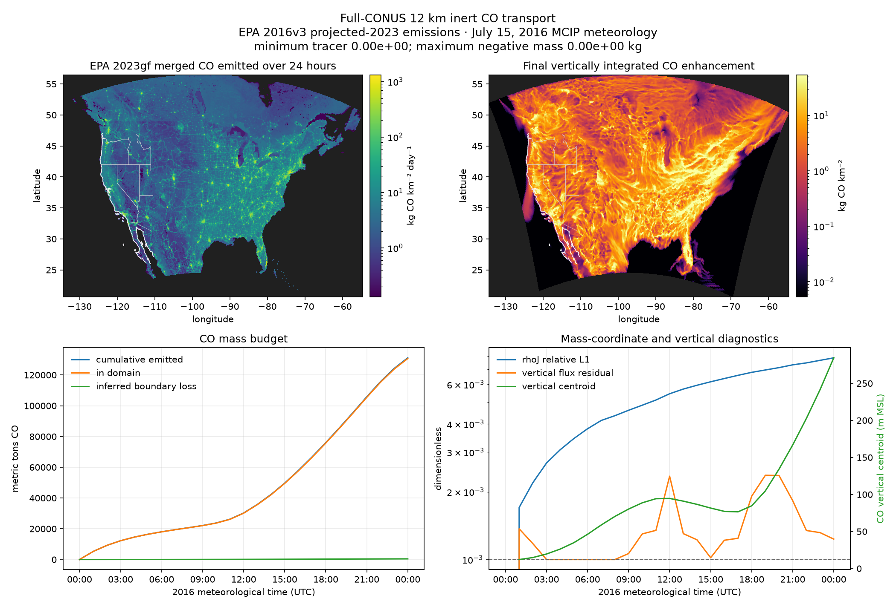
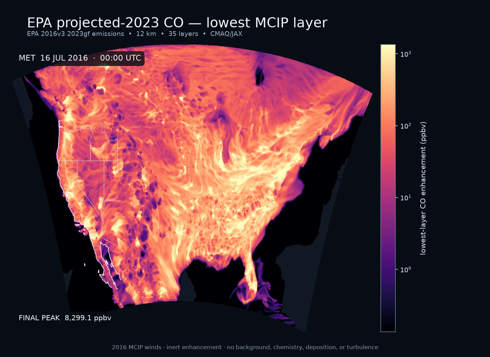

# Full-CONUS 12 km projected-2023 CO transport

This experiment transports an inert CO enhancement for 24 hours on EPA's
459 × 299 cell `12US1` modeling domain.  It uses all 35 MCIP layers, the native
C-staggered winds, CMAQ/JAX horizontal and vertical advection, and exact model
frames every 15 minutes.

The completed case is:

> EPA 2016v3 `2023gf` projected emissions · July 15, 2016 matching MCIP
> meteorology

That date pairing is intentional.  EPA's
[2016v3 platform](https://www.epa.gov/air-emissions-modeling/2016v3-platform)
provides analytic 2023 emissions with the 2016 meteorology and temporal
profiles used to build the case.  This is therefore a 2023 **emissions
scenario**, not transport under July 2023 weather.

The [USGS CONUS404 release](https://www.usgs.gov/data/conus404-four-kilometer-long-term-regional-hydroclimate-reanalysis-over-conterminous-united)
now extends through 2024, but its readily accessible hourly subset does not
provide the all-level 3-D winds needed here for 2023.  The full raw WRF archive
requires a separate archive request.  Using EPA's internally matched MCIP and
emissions inputs makes this 12 km case reproducible now without mixing
incompatible grids or mass fields.

## What “all CO emissions” means here

The source is the `CO` variable in EPA's final
`merged_withbeis_withrwc` hourly gridded file.  Its own `DESCRIPTION` metadata
lists the merged inputs: U.S., Canadian, and Mexican on-road sources; non-road;
rail; airports; nonpoint; oil and gas; solvents; residential wood combustion;
agriculture and livestock; fertilizer; adjusted fugitive dust; and BEIS4
biogenic emissions.  This is substantially broader than the earlier
fire-only California test.

It is not literally every possible CO source in the platform.  EPA stores
elevated point and commercial-marine sources in separate inline files, and
day-specific fires are also separate.  Those sources and plume rise are not
included in this first run.  All 131,146.6 metric tons of CO found in the
downloaded merged gridded file are included, with the file's hourly variation.
Because the file has one layer, its CO is injected into the lowest MCIP layer.

There is no chemical background at the boundary.  “CO” therefore means an
emitted enhancement, not total atmospheric CO.

## Reproduce the run

Install the I/O and visualization dependencies:

```bash
uv pip install -e ".[dev,io]"
```

Download the four public inputs.  They occupy about 12.1 GB; the downloader
uses resumable `.part` targets and does not replace complete files.

```bash
.venv/bin/python examples/epa_2023/download_inputs.py
```

Run 24 hours in float32 and save 97 exact states at 15-minute intervals:

```bash
.venv/bin/python examples/epa_2023/run_transport.py \
    --hours 24 --frame-minutes 15
```

Fetch the lightweight map boundaries once and render the column, lowest-layer,
and diagnostic outputs:

```bash
.venv/bin/python examples/conus404/fetch_boundaries.py
.venv/bin/python examples/epa_2023/make_visualizations.py \
    --run examples/epa_2023/output/transport_2023gf_20160715_24h_12km.npz \
    --diagnostics examples/epa_2023/output/transport_2023gf_20160715_24h_12km.csv \
    --interpolation 1 --fps 12
```

Downloaded inputs and numeric results are git-ignored.  The regenerable GIFs
and PNGs under `figures/` are committed.

## Physical and numerical setup

- **Grid:** EPA `12US1`, 459 × 299 cells at 12 km, with all 35 terrain-following
  MCIP layers.
- **Meteorology:** hourly WRFv3.8/MCIP `METCRO3D`, `METDOT3D`, and `GRIDCRO2D`
  for 00 UTC July 15 through 00 UTC July 16, 2016.
- **Atmospheric mass:** MCIP `DENSA_J`, transported as the last coupled slot and
  compared with the next hourly MCIP mass field after each step.
- **Emissions:** hourly EPA `2023gf` gridded CO in mol s⁻¹, converted with a
  28.01 g mol⁻¹ molar mass and split half before/half after every synchronization
  step.
- **Boundaries:** zero CO enhancement at inflow; meteorological mass at every
  boundary and layer.  Outflow follows the CMAQ advection boundary rule.
- **Processes:** HADV + ZADV only.  There is no chemistry, deposition,
  horizontal diffusion, plume rise, or turbulent vertical mixing.
- **Precision/backend:** float32 on CPU.  The experimental JAX Metal backend
  was slower or unchanged in the smaller California benchmark and did not
  satisfy the vertical residual tolerance, so it was not used for this
  validation run.

## Measured 24-hour result

The transport computation finished in 475.9 seconds (7 min 56 s) on the
development laptop's CPU.  Loading inputs and writing the 185.8 MB compressed
result are outside that timer.

Runtime was close to linear in simulated duration: about 7.9 minutes per day.
An 8-hour overnight compute window would therefore cover roughly 60 days and a
12-hour window roughly 90 days.  Retaining every daily forcing set takes about
11 GB per day, however.  With 930 GiB free during this test, 60 days (about
660 GB of forcing) is practical, while 90 days requires processing and deleting
forcing sequentially.  The current command handles one 24-hour case; a
continuous multi-day experiment still needs restart-state carryover and a
streaming daily input driver rather than independent daily restarts.

| Diagnostic | Result |
|---|---:|
| grid / transported layers | 459 × 299 / 35 |
| synchronization steps / saved frames | 324 / 97 |
| emitted CO | 131,146.619 metric tons |
| CO remaining in domain | 130,699.233 metric tons |
| inferred boundary loss | 447.386 metric tons (0.341%) |
| minimum tracer / maximum negative mass | 0 / 0 kg |
| final `rhoJ` relative L1 mismatch | 0.787% |
| maximum vertical flux residual | 2.368 × 10⁻³ |
| maximum vertical Courant / substeps | 9.299 / 8 |
| final CO vertical centroid | 284.5 m MSL |
| final maximum column enhancement | 1,049.2 kg km⁻² |
| final maximum lowest-layer enhancement | 8,299 ppbv |

`inferred_boundary_loss_kg` is diagnosed from the domain mass change after the
known source is added; it is not an independently integrated face flux.  The
reported budget residual is consequently arithmetic closure.  Positivity is
the stronger independent result: no negative tracer mass appeared at any
hour.

The vertical flux residual modestly exceeds the nominal `1e-3` target in a few
steps, reaching `2.368e-3`.  This is recorded rather than hidden and should be
revisited when the float32 vertical solver is tightened.

## Figures





- [`transport_2023gf_20160715_24h_12km.gif`](figures/transport_2023gf_20160715_24h_12km.gif)
  shows vertically integrated CO in 97 exact 15-minute model states.
- [`transport_2023gf_20160715_24h_12km_ground_level.gif`](figures/transport_2023gf_20160715_24h_12km_ground_level.gif)
  shows lowest-layer enhancement in ppbv at the same times.  Both animations
  include the interpolated lowest-layer winds.

## Limits on interpretation

This is an advection validation, not a complete CO air-quality simulation.  In
particular, injecting the one-layer inventory at the surface without
planetary-boundary-layer mixing leaves source-cell CO unrealistically
concentrated.  The 8,299 ppbv maximum in the ground-level figure is therefore
not monitor-equivalent.  Adding turbulent vertical mixing is the next required
physics step before interpreting surface concentrations; adding the separate
inline point, marine, and fire files would be the next emissions step.
